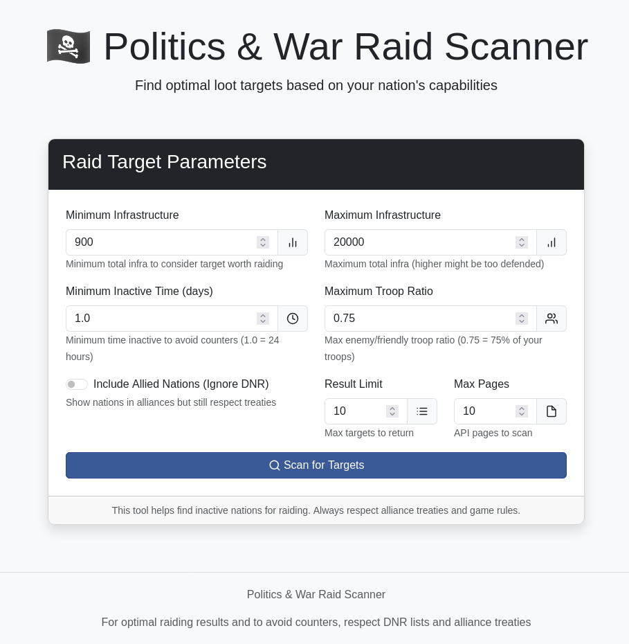
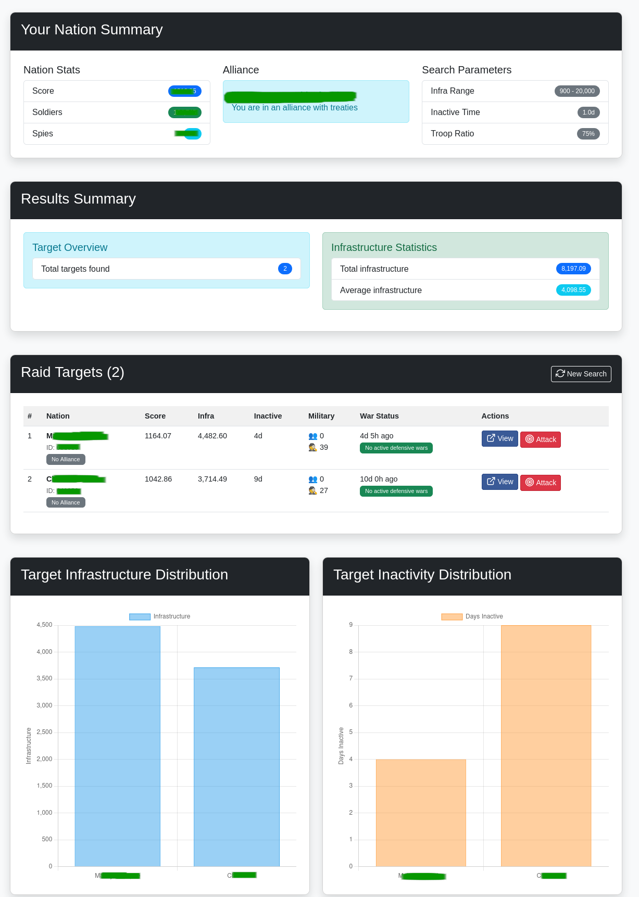
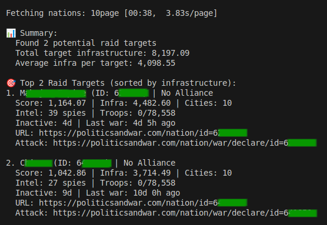

# PnW Raid Recon

[](https://opensource.org/licenses/MIT)

A sophisticated web-based tool designed for Politics and War players to strategically identify and analyze optimal raiding targets while minimizing diplomatic risks.

## Key Features

- Advanced target selection algorithms with configurable parameters
- Real-time API integration with Politics & War game
- Intelligent data processing with multi-layered filtering
- Interactive web interface for comprehensive target exploration
- Direct command-line usage for rapid target identification
- Strict filtering to avoid nations with active defensive wars

## Installation

1. Clone this repository:

   ```
   git clone https://github.com/yourusername/PnW-Raid-Recon.git
   cd PnW-Raid-Recon
   ```

2. Set up your environment variables by copying the sample file:

   ```
   cp .env.sample .env
   ```

3. Edit the `.env` file with your Politics & War API key:

   ```
   PNW_API_KEY=your_api_key_here
   ```

4. Install required packages:

   ```
   pip install -r requirements.txt
   ```

## Usage

### Web Interface

Run the Flask application:

```
python app.py
```

This will start a web server at <http://localhost:5000> where you can configure parameters and search for targets through the browser interface.

#### Start page



#### Result page



### Command Line Interface

Run directly from the command line for quick results:

```
python raid.py
```

#### Command result



### Command Line Options

```
python raid.py --min-infra 900 --max-infra 20000 --inactive-time 1.0 --limit 10
```

Available parameters:

- `--min-infra`: Minimum infrastructure to target (default: 900)
- `--max-infra`: Maximum infrastructure to target (default: 20000)
- `--inactive-time`: Minimum days of inactivity (default: 1.0)
- `--ignore-dnr`: Show nations in alliances but still respect treaties (default: False)
- `--troop-ratio`: Maximum enemy/friendly troop ratio (default: 0.75)
- `--limit`: Maximum number of targets to display (default: 10)
- `--max-pages`: Maximum API pages to fetch (default: 10)
- `--json`: Output results in JSON format

## Configuration

You can adjust default parameters in `config.py`:

```python
# Default parameters
MIN_INFRA = 900             # Minimum infrastructure to target
MAX_INFRA = 20000           # Maximum infrastructure to target
MIN_INACTIVE_DAYS = 1.0     # Minimum days of inactivity
IGNORE_DNR = False          # Whether to show nations with alliances
MAX_PAGES = 10              # Maximum pages to fetch from API
MAX_SOLDIER_RATIO = 0.75    # Maximum enemy/friendly troop ratio
```

## How It Works

1. **Authentication**: Uses your P&W API key to access nation data
2. **Filtering**: Applies intelligent filtering to identify optimal targets:
   - Infrastructure within specified range
   - Nation score within valid war range (75-150% of your score)
   - Inactive for specified minimum time period
   - Nation has no active defensive wars (turnsleft > 0)
   - No alliance or treaty protection
   - Low troop count relative to attacker
3. **Results**: Displays potential targets with detailed information and direct attack links

## Security and Ethics

- The tool respects P&W's game rules and alliance treaties
- Strict filtering to avoid nations with active defensive wars prevents diplomatic incidents
- Only uses publicly available API data and does not employ any exploits

## Contributing

Contributions are welcome! Please feel free to submit a Pull Request.

## License

This project is licensed under the MIT License - see the LICENSE file for details.
